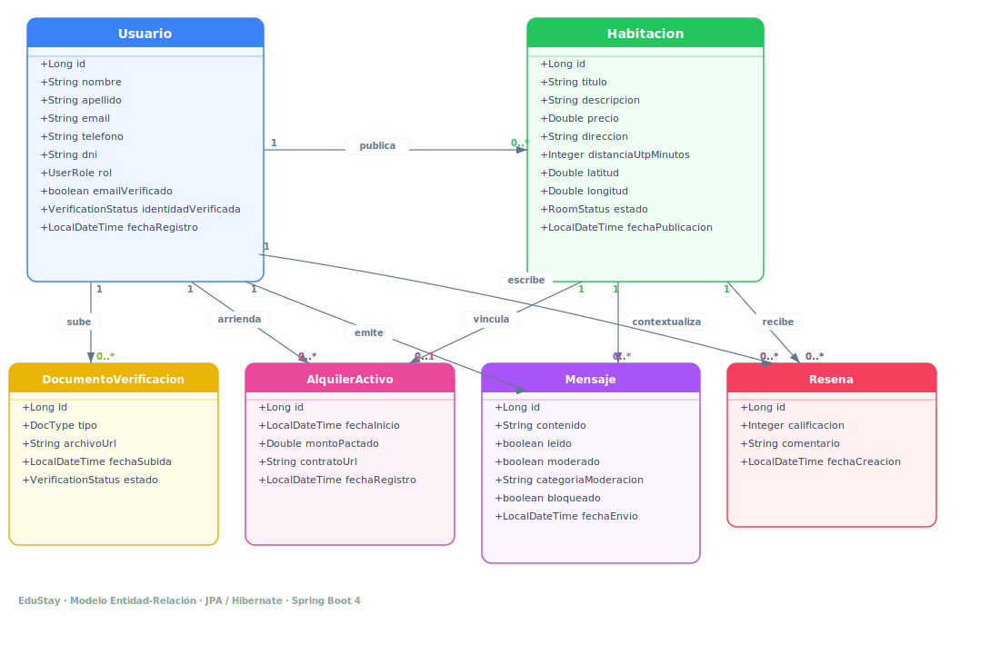

<!-- _class: cover -->

<div class="cover-header">
  <h1>EduStay</h1>
  <h2>Sistema Web de Gestión y Alquiler de Habitaciones Universitarias</h2>
</div>

<div class="cover-footer">
  <div class="cover-meta">
    <span>Universidad Tecnológica del Perú (UTP)</span>
    <span>Curso: Desarrollo Web Integrado</span>
  </div>
  <div class="cover-meta" style="text-align: right;">
    <span class="cover-author">Sustentación de Proyecto Final</span>
    <span>Año 2026</span>
  </div>
</div>

<!-- Tiempo estimado: 60 segundos -->
<!--
Speaker Notes:
Dar la bienvenida al jurado y presentar el proyecto EduStay como una solución tecnológica diseñada para resolver el problema de alojamiento de la comunidad universitaria de la UTP Sede Piura.
-->

---

# **Agenda de la Sustentación**

- **Bloque 1**: Contexto del Proyecto y Arquitectura General
- **Bloque 2**: API REST, Persistencia y Seguridad
- **Bloque 3**: Frontend y Experiencia de Usuario
- **Bloque 4**: Integración, Despliegue y Resultados

*Cada bloque concluye con una demostración técnica en vivo.*

<!-- Tiempo estimado: 30 segundos -->
<!--
Speaker Notes:
Explicar la distribución de la sustentación en cuatro bloques equilibrados que cubren el ciclo completo de desarrollo del software.
-->

---

<!-- BLOQUE 1 -->
<!-- _class: block-header -->

<h2>BLOQUE 1</h2>
<h1>Contexto del Proyecto</h1>
<h2>y Arquitectura General</h2>

<div class="progress-bar">
  <div class="progress-step active"></div>
  <div class="progress-step"></div>
  <div class="progress-step"></div>
  <div class="progress-step"></div>
</div>

<!-- Tiempo estimado: 30 segundos -->
<!--
Speaker Notes:
Dar inicio al primer bloque explicativo centrado en el negocio y la topología técnica del sistema.
-->

---

# **1. Definición del Problema**

- **Deslocalización Estudiantil**: Alumnos de provincias buscando alojamiento en la periferia de la UTP Sede Piura.
- **Informalidad de la Oferta**: Estafas con transferencias previas y duplicación de anuncios falsos.
- **Falta de Precisión Geográfica**: Coordenadas imprecisas que dificultan verificar la distancia real al campus.
- **Canales de Comunicación Inseguros**: Intercambios de datos no moderados a través de redes sociales informales.

<!-- Tiempo estimado: 60 segundos -->
<!--
Speaker Notes:
Detallar los dolores reales del estudiante: el fraude por coordenadas falsas y el riesgo de seguridad en la comunicación informal.
-->

---

# **2. Objetivos del Sistema**

- **Mitigar Riesgo de Identidad**: Validar oficialmente a estudiantes y arrendadores locales.
- **Garantizar Ubicación**: Verificar geográficamente la veracidad y distancia del alojamiento.
- **Asegurar la Comunicación**: Ofrecer un chat privado con moderación automática en tiempo real.
- **Formalizar el Arrendamiento**: Facilitar la carga de contratos firmados digitalmente bajo un marco de deslinde legal.

<!-- Tiempo estimado: 60 segundos -->
<!--
Speaker Notes:
Mencionar los pilares de EduStay: identidad validada, ubicación comprobada y comunicación moderada.
-->

---

# **3. Arquitectura General del Sistema**



*✔ Deploy* *✔ Angular* *✔ Spring Boot*

<!-- Tiempo estimado: 90 segundos -->
<!--
Speaker Notes:
Describir la topología de la aplicación. Detallar que es una arquitectura distribuida y sin estado (stateless). El frontend interactúa únicamente con el backend por HTTP enviando payloads JSON y adjuntando tokens JWT.
-->

---

# **4. Diagrama del Modelo de Datos**



*✔ JPA* *✔ Hibernate*

<!-- Tiempo estimado: 90 segundos -->
<!--
Speaker Notes:
Explicar el modelo entidad-relación lógico mapeado por Hibernate. Detallar cómo se relacionan los arrendadores con las habitaciones (1 a muchos) y los alquileres como una entidad intermedia con el enlace físico al contrato.
-->

---

# **Demostración - Bloque 1**

- **Landing Page**: Exploración pública de habitaciones y visualización responsiva.
- **Navegación General**: Búsqueda inicial de anuncios georreferenciados sin inicio de sesión.
- **Base de Datos Inicial**: Estructura de tablas e inserción automática de semillas a través de `DataSeeder.java`.

<!-- Imagen: Landing Page -->

<!-- Tiempo estimado: 60 segundos -->
<!--
Speaker Notes:
Guiar al público a través del navegador mostrando la página principal sin autenticar, demostrando el acceso público inicial.
-->

<!-- FIN BLOQUE 1 -->

---

<!-- BLOQUE 2 -->
<!-- _class: block-header -->

<h2>BLOQUE 2</h2>
<h1>API REST y Seguridad</h1>
<h2>Persistencia y Autorización</h2>

<div class="progress-bar">
  <div class="progress-step active"></div>
  <div class="progress-step active"></div>
  <div class="progress-step"></div>
  <div class="progress-step"></div>
</div>

<!-- Tiempo estimado: 30 segundos -->
<!--
Speaker Notes:
Introducir al segundo expositor enfocado en la lógica del backend y la seguridad de la información.
-->

---

# **1. Arquitectura del Backend**



*✔ Spring Boot* *✔ Dependency Injection*

<!-- Tiempo estimado: 60 segundos -->
<!--
Speaker Notes:
Explicar el flujo interno en el backend. Los controladores inyectan servicios, y estos a su vez los repositorios. La capa del service encapsula la lógica transaccional mediante la anotación `@Transactional`.
-->

---

# **2. Implementación de Controladores y DTOs**

- **RESTful Endpoints**: Controladores limpios e independientes (`HabitacionController`, `AuthController`, `AdminController`).
- **Patrón DTO**: Clases `RegisterRequest` e `HabitacionResponse` para evitar la sobre-exposición de entidades JPA.
- **Validación Declarativa**: Uso de `@Valid` y anotaciones de Jakarta Bean Validation:
```java
public class RegisterRequest {
    @NotBlank @Email
    private String email;
    @Size(min = 6)
    private String password;
}
```
*✔ REST* *✔ Validation* *✔ DTO*

<!-- Tiempo estimado: 60 segundos -->
<!--
Speaker Notes:
Detallar cómo los DTOs filtran los atributos que el cliente no necesita o no debe ver, y cómo `@Valid` impide que datos corruptos lleguen a la lógica del negocio.
-->

---

# **3. Persistencia de Datos y JPQL**

- **Spring Data JPA**: Repositorios herederos de `JpaRepository` con generación de consultas automáticas.
- **JPQL y Consultas Nativas**: Haversine para cálculo de distancia:
```sql
SELECT h, (6371 * acos(cos(radians(:lat)) * ...)) AS distance 
FROM Habitacion h
```
- **Control Transaccional**: `@Transactional` garantiza atomicidad al registrar alquileres activos.

*✔ JPA* *✔ Hibernate*

<!-- Tiempo estimado: 60 segundos -->
<!--
Speaker Notes:
Hablar de cómo las consultas de geolocalización se calculan del lado de la base de datos para eficiencia y cómo el JpaRepository facilita las operaciones CRUD.
-->

---

# **4. Manejo Global de Excepciones**

- **Centralización**: Uso de `@RestControllerAdvice` en `GlobalExceptionHandler.java`.
- **Formateo JSON**: Captura de excepciones en tiempo de ejecución para evitar trazas Java vulnerables en el cliente.
```java
@RestControllerAdvice
public class GlobalExceptionHandler {
    @ExceptionHandler(IllegalArgumentException.class)
    public ResponseEntity<ErrorDTO> handleBadRequest(Exception ex) {
        return ResponseEntity.badRequest().body(new ErrorDTO(ex.getMessage()));
    }
}
```
*✔ Global Exception Handler*

<!-- Tiempo estimado: 60 segundos -->
<!--
Speaker Notes:
Explicar cómo capturamos excepciones en tiempo de ejecución para evitar que el backend devuelva trazas de error Java vulnerables al cliente.
-->

---

# **5. Seguridad con JWT**



*✔ Spring Security* *✔ JWT*

<!-- Tiempo estimado: 90 segundos -->
<!--
Speaker Notes:
Explicar cómo funciona el flujo stateless del filtro de seguridad y cómo se segregan los roles de estudiantes, arrendadores y administradores.
-->

---

# **Demostración - Bloque 2**

- **POST /api/auth/login**: Envío de credenciales y retorno del token JWT.
- **Acceso Autorizado**: Petición a `/api/admin/usuarios` adjuntando el JWT en la cabecera HTTP.
- **Acceso Denegado**: Intento de un Estudiante de acceder a endpoints de administración, arrojando `403 Forbidden`.

<!-- Imagen: Swagger -->

<!-- Tiempo estimado: 60 segundos -->
<!--
Speaker Notes:
Demostrar el flujo de autenticación y el bloqueo de rutas utilizando Postman o la interfaz de Swagger.
-->

<!-- FIN BLOQUE 2 -->

---

<!-- BLOQUE 3 -->
<!-- _class: block-header -->

<h2>BLOQUE 3</h2>
<h1>Frontend y Experiencia de Usuario</h1>
<h2>Reactividad, Routing y SCSS</h2>

<div class="progress-bar">
  <div class="progress-step active"></div>
  <div class="progress-step active"></div>
  <div class="progress-step active"></div>
  <div class="progress-step"></div>
</div>

<!-- Tiempo estimado: 30 segundos -->
<!--
Speaker Notes:
Presentar al tercer expositor encargado de la experiencia de usuario y arquitectura del cliente web.
-->

---

# **1. Arquitectura del Frontend en Angular**

- **Componentes Standalone**: Componentes independientes sin módulos.
- **Estructuración por Carpetas**:
  - `core/`: Servicios centrales, modelos e interceptores de red.
  - `features/`: Vistas y módulos de negocio (auth, habitaciones, admin, perfil).
  - `shared/`: Componentes de UI comunes y reutilizables.

*✔ Angular*

<!-- Tiempo estimado: 90 segundos -->
<!--
Speaker Notes:
Explicar el valor de usar componentes independientes (Standalone) y cómo esta estructura permite separar la lógica de conexión (core) de las características visuales (features), optimizando el empaquetado final.
-->

---

# **2. Estructura de Directorios del Core**

- `/core/services/`: Comunicación directa con backend (ej. `auth.service.ts`).
- `/core/interceptors/`: Inyección de cabeceras HTTP (`jwt.interceptor.ts`).
- `/core/guards/`: Control de acceso a nivel de enrutamiento (`AuthGuard`).
- `/features/habitaciones/`: Lógica de búsqueda, detalle y selector de mapa.

*✔ Routing* *✔ REST Client*

<!-- Tiempo estimado: 60 segundos -->
<!--
Speaker Notes:
Describir brevemente el propósito de cada subdirectorio del frontend para demostrar la limpieza del diseño.
-->

---

# **3. Reactividad y Gestión del Estado**

- **Angular Signals**: Detección de cambios granular que actualiza solo los componentes necesarios.
- **Estado de Sesión**:
```typescript
export class AuthService {
  user = signal<UserResponse | null>(null);
  isAuthenticated = signal<boolean>(false);
}
```
- **Integración Fluida**: Vistas enlazadas de manera síncrona a los cambios de la sesión del usuario.

<!-- Tiempo estimado: 60 segundos -->
<!--
Speaker Notes:
Explicar cómo Signals reemplaza el ciclo digest clásico de Angular, acelerando el rendimiento en renderizado del DOM.
-->

---

# **4. Formularios Reactivos y UX**

- **Validación Reactiva**: Formularios gestionados mediante código (`FormGroup`), informando al usuario en tiempo real.
- **SASS Estructurado**: Variables de color globales y mixins responsivos adaptables a cualquier dispositivo.
- **Selector de Ubicación**: Campos de coordenadas de solo lectura actualizados mediante un clic en el mapa interactivo.

*✔ Formularios*

<!-- Tiempo estimado: 60 segundos -->
<!--
Speaker Notes:
Explicar cómo la validación reactiva asiste al usuario e impedir que envíe datos incorrectos.
-->

---

# **Demostración - Bloque 3**

- **Registro e Inicio de Sesión**: Validación de campos e interactividad visual en tiempo real.
- **Búsqueda & Filtros**: Catálogo de habitaciones interactivo con filtros de precio y geolocalización.
- **Vista Responsiva**: Demostración de adaptabilidad móvil simulada en el navegador.

<!-- Imagen: Flujo de Login -->

<!-- Tiempo estimado: 60 segundos -->
<!--
Speaker Notes:
Interactuar con la aplicación web demostrando la validación visual y la rapidez de respuesta ante los filtros del catálogo.
-->

<!-- FIN BLOQUE 3 -->

---

<!-- BLOQUE 4 -->
<!-- _class: block-header -->

<h2>BLOQUE 4</h2>
<h1>Integración y Despliegue</h1>
<h2>Servicios Externos, Retos y Conclusiones</h2>

<div class="progress-bar">
  <div class="progress-step active"></div>
  <div class="progress-step active"></div>
  <div class="progress-step active"></div>
  <div class="progress-step active"></div>
</div>

<!-- Tiempo estimado: 30 segundos -->
<!--
Speaker Notes:
Presentar al último expositor encargado del despliegue en la nube, retos del equipo y conclusiones.
-->

---

# **1. Integración Frontend ↔ Backend**


*✔ REST Client*

<!-- Tiempo estimado: 60 segundos -->
<!--
Speaker Notes:
Detallar cómo el interceptor de red gestiona el token sin intervenciones manuales repetitivas en cada servicio.
-->

---

# **2. Integración de Servicios Externos**

- **Mensajería OTP (Resend)**: Envío automático de códigos de verificación OTP por correo durante el registro.
- **Geolocalización Interactiva (Leaflet)**:
  - Carga asíncrona robusta con reintentos.
  - Corrección de renderizado con `invalidateSize()`.
  - Ruta de distancia caminando calculada hacia la UTP Piura.

<!-- Imagen: Diagrama ER -->

<!-- Tiempo estimado: 60 segundos -->
<!--
Speaker Notes:
Explicar el uso del proveedor de emails Resend y el mapa Leaflet, solucionando el problema de los tiles recortados en gris.
-->

---

# **3. Arquitectura de Despliegue**

- **Client Web (Angular)**: Desplegado en **Vercel** para carga optimizada en CDN global.
- **REST API (Spring Boot)**: Alojado en **Render** dentro de un contenedor Docker virtualizado.
- **Base de Datos**: MySQL Cloud persistente y seguro.
- **Variables de Entorno**: Credenciales y llaves de APIs privadas totalmente seguras en producción.

*✔ Deploy*

<!-- Tiempo estimado: 60 segundos -->
<!--
Speaker Notes:
Explicar la arquitectura física en producción y las ventajas de escalabilidad al separar el alojamiento del cliente y del servidor.
-->

---

# **4. Pipeline de CI/CD (Despliegue Continuo)**

- **Automatización**: GitOps automatizado mediante webhooks conectados a GitHub.
- **Frontend (Angular)**:
  - Disparador: Cada `git push` a la rama `master`.
  - Proceso: Vercel ejecuta pruebas, compila producción y propaga cambios en segundos.
- **Backend (Spring Boot)**:
  - Disparador: Cada `git push` a la rama `main`.
  - Proceso: Render descarga el código, empaqueta el `.jar` e inicializa el servidor en la nube.

*✔ CI/CD* *✔ GitOps*

<!-- Tiempo estimado: 60 segundos -->
<!--
Speaker Notes:
Explicar cómo la integración de Git con Vercel y Render reduce las tareas manuales de empaquetado y subida FTP, garantizando que el código de producción siempre coincida con la rama principal de Git.
-->

---

# **5. Buenas Prácticas de Ingeniería**

- **Separación de Capas**: Responsabilidad única en clases y carpetas.
- **Patrón Repositorio**: Aislamiento del motor SQL físico mediante JPA.
- **Seguridad en Datos**: Contraseñas cifradas con `BCryptPasswordEncoder` en BD.
- **Manejo de Errores Global**: Respuestas normalizadas ante fallos.
- **Variables de Entorno**: Aislamiento de datos sensibles de producción.

<!-- Tiempo estimado: 60 segundos -->
<!--
Speaker Notes:
Resumir el apego a las convenciones de diseño de software para garantizar la mantenibilidad y extensibilidad futura.
-->

---

# **6. Retos Técnicos Encontrados y Soluciones**

| Reto Encontrado | Diagnóstico Técnico | Solución Adoptada |
| :--- | :--- | :--- |
| **Tiles de Leaflet recortados** | El contenedor HTML inicializa con 0px antes de calcular CSS. | Invocación diferida de `invalidateSize()` tras render del DOM. |
| **Fallas de CORS en Producción** | Dominios Vercel y Render distintos bloqueados por seguridad del navegador. | Registro de beans CORS específicos en la configuración de Spring Security. |
| **Diferencias de Clases de Usuarios** | Registro unificado pero lógica distinta para Estudiantes y Arrendadores. | Modularización por roles con verificación DNI condicional. |

<!-- Tiempo estimado: 90 segundos -->
<!--
Speaker Notes:
Explicar cómo resolvieron los tres principales cuellos de botella técnicos enfrentados durante la fase de integración.
-->

---

# **7. Resultados y Funcionalidades Obtenidas**

- **Seguridad**: Autenticación JWT y verificación DNI.
- **Integración de Mapas**: Coordenadas reales del mapa selector.
- **Auditoría**: Panel para desestimar o eliminar alertas de chat con IA.
- **Gestión**: Firma y registro de contratos PDF con deslinde legal.
- **Comunicación**: Chats funcionales y emails de alerta por Resend.

<!-- Imagen: Dashboard -->

<!-- Tiempo estimado: 60 segundos -->
<!--
Speaker Notes:
Enumerar las funcionalidades de la aplicación real, demostrando que cumple con todos los objetivos planteados.
-->

---

# **Demostración Final - Bloque 4**

- **Simulación del Flujo de Integración**:
  1. Registro de Estudiante con Código OTP por email real.
  2. Carga física de DNI en Perfil de Usuario.
  3. Registro de Habitación y coordenadas usando el selector de mapa.
  4. Reserva de Habitación con contrato PDF y deslinde de responsabilidad.
  5. Recepción automática de correos de confirmación.

<!-- Tiempo estimado: 120 segundos -->
<!--
Speaker Notes:
Mostrar de principio a fin el flujo integrado, validando la comunicación y persistencia del sistema en producción.
-->

---

# **Conclusiones y Trabajo Futuro**

- **Conclusión**: Logramos un flujo de alquiler verificado y transparente, reduciendo fraudes en comunidades estudiantiles.
- **Trabajo Futuro**:
  - Incorporar pasarelas de pago digitales (MercadoPago).
  - Sistema inteligente de recomendación de compañeros de cuarto.

<!-- Tiempo estimado: 60 segundos -->
<!--
Speaker Notes:
Cerrar la sustentación indicando la viabilidad del proyecto y sus posibilidades de crecimiento a nivel nacional.
-->

---

<!-- _class: lead -->
# **¡Muchas Gracias!**
### ¿Tienen alguna pregunta?

<!-- Tiempo estimado: 60 segundos -->
<!--
Speaker Notes:
Dar gracias al jurado evaluador y dar paso a la ronda de preguntas técnicas del jurado.
-->

<!-- FIN BLOQUE 4 -->
