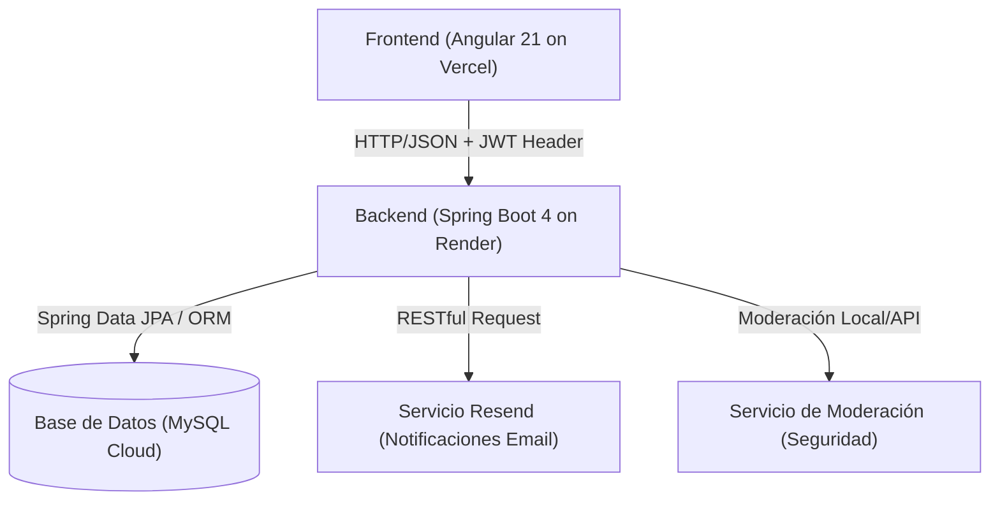
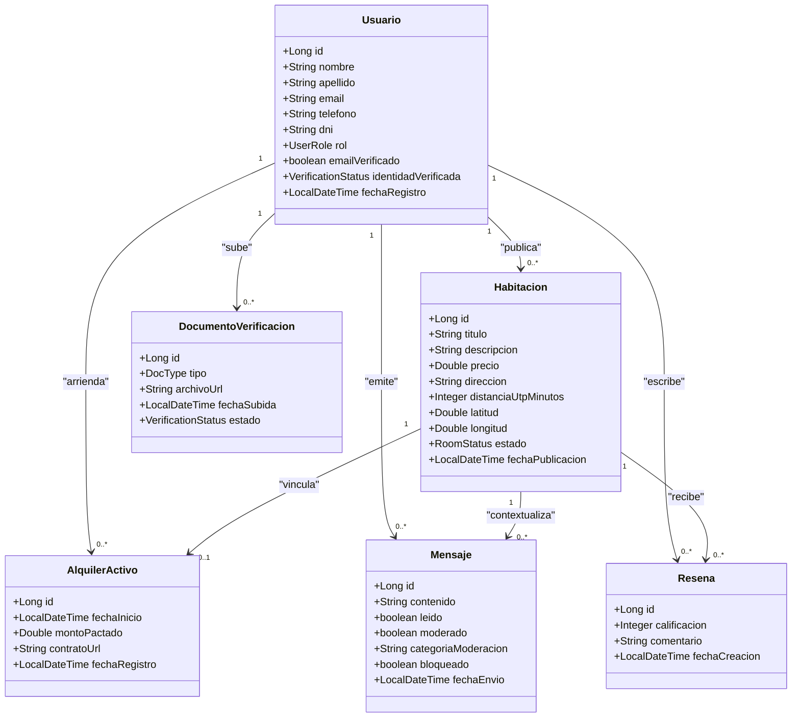
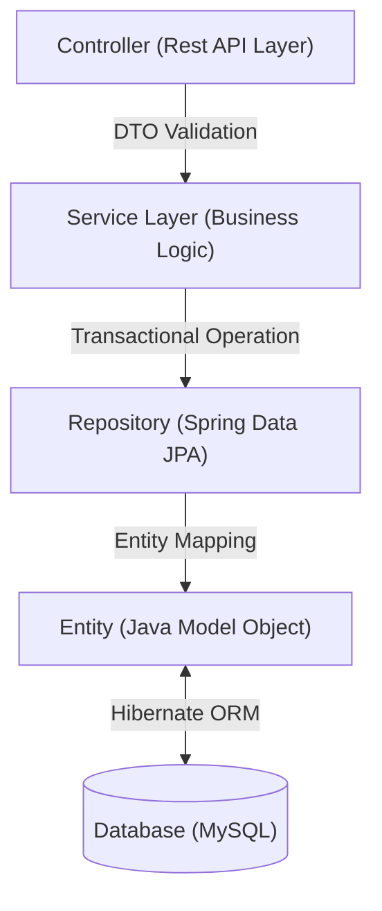
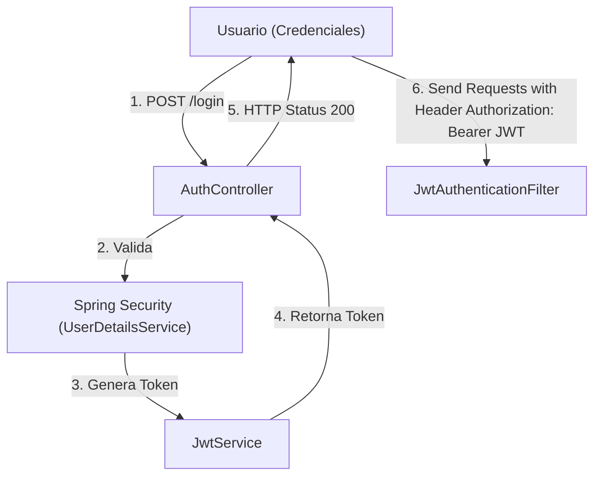
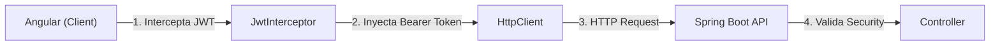

# **EduStay**
### Sistema Web de Gestión y Alquiler de Habitaciones Universitarias

**Proyecto de Desarrollo Web Integrado**
*Sustentación de Arquitectura e Implementación Full Stack*

<!--
Duración estimada: 1 minuto
Estudiante responsable: Integrante 1 (Bloque 1)
-->

---

# **Agenda de la Sustentación**

- **Bloque 1**: Contexto del Proyecto y Arquitectura General (Min 0:00 - 6:00)
- **Bloque 2**: API REST, Persistencia y Seguridad (Min 6:00 - 12:00)
- **Bloque 3**: Frontend y Experiencia de Usuario (Min 12:00 - 18:00)
- **Bloque 4**: Integración, Despliegue y Resultados (Min 18:00 - 24:00)

*Cada sección concluirá con una demostración del módulo correspondiente.*

<!--
Duración estimada: 1 minuto
Estudiante responsable: Integrante 1 (Bloque 1)
-->

---

<!-- BLOQUE 1 -->
<!-- Tiempo estimado del bloque: 6 minutos -->

<!-- _class: lead -->
# **BLOQUE 1**
## **Contexto del Proyecto y Arquitectura General**

<!--
Duración estimada: 30 segundos
Estudiante responsable: Integrante 1
-->

---

# **1. Definición del Problema**

- **Deslocalización Estudiantil**: Alta demanda de alojamiento temporal en la periferia de la UTP Sede Piura por alumnos de provincias.
- **Informalidad de Información**: Fraude en ubicaciones geográficas, duplicación de anuncios y precios inflados.
- **Falta de Validación Jurídica**: Ausencia de deslinde de responsabilidad claro y contratos estructurados firmados digitalmente.
- **Inseguridad en Canales de Comunicación**: Intercambios de datos no moderados propensos al acoso o lenguajes de odio.

<!--
Duración estimada: 1 minuto 30 segundos
Notas del Expositor:
Explicar el dolor del usuario (estudiante foráneo) enfocándose en la falta de veracidad geográfica y la inseguridad legal. Mencionar cómo el mercado informal actual en redes sociales carece de garantías de identidad, lo que motivó el desarrollo de EduStay como alternativa robusta.
-->

---

# **2. Objetivos y Público Objetivo**

- **Objetivo General**:
  Desarrollar un sistema web desacoplado y seguro que conecte a estudiantes verificados con arrendadores locales.
- **Objetivos Específicos**:
  - Validar geográficamente las habitaciones respecto al campus universitario.
  - Ofrecer un canal de mensajería con moderación automática en base a reglas comunitarias.
  - Mitigar el riesgo de identidad mediante carga física y auditoría de DNI/Carnet.
- **Público Objetivo**: Comunidad universitaria (UTP) y arrendadores validados.

<!--
Duración estimada: 1 minuto
Notas del Expositor:
Destacar que no es un sistema de turismo general, sino una intranet cerrada para comunidades universitarias. Explicar que la verificación de la identidad y la ubicación son las columnas de confianza del sistema.
-->

---

# **3. Arquitectura General del Sistema**

*✔ Deploy* *✔ Angular* *✔ Spring Boot*

<!--
Duración estimada: 1 minuto
Notas del Expositor:
Describir la topología de la aplicación. Detallar que es una arquitectura distribuida y sin estado (stateless). El frontend interactúa únicamente con el backend por HTTP enviando payloads JSON y adjuntando tokens JWT.
-->

---

# **4. Diagrama del Modelo de Datos (JPA/Hibernate)**

*✔ JPA* *✔ Hibernate*

<!--
Duración estimada: 1 minuto
Notas del Expositor:
Explicar el modelo entidad-relación lógico mapeado por Hibernate. Detallar cómo se relacionan los arrendadores con las habitaciones (1 a muchos) y los alquileres como una entidad intermedia con el enlace físico al contrato.
-->

---

# **Demostración - Bloque 1**

- **Visualización de la Landing Page**:
  - Interfaz de bienvenida limpia y adaptada a la identidad universitaria.
- **Exploración General**:
  - Consulta pública de habitaciones existentes.
- **Estructura Inicial**:
  - Revisión física en consola de cómo el backend expone el modelo relacional a través del seeder (`DataSeeder.java`).

<!--
Duración estimada: 1 minuto
Notas del Expositor:
Guiar al público a través del navegador mostrando la página principal sin autenticar, demostrando el acceso público inicial.
-->

<!-- FIN BLOQUE 1 -->

---

<!-- BLOQUE 2 -->
<!-- Tiempo estimado del bloque: 6 minutos -->

<!-- _class: lead -->
# **BLOQUE 2**
## **API REST, Persistencia y Seguridad**

<!--
Duración estimada: 30 segundos
Estudiante responsable: Integrante 2
-->

---

# **1. Arquitectura Interna del Backend**

*✔ Spring Boot* *✔ Dependency Injection* *✔ Separation of Concerns*

<!--
Duración estimada: 1 minuto
Notas del Expositor:
Explicar el flujo interno en el backend. Los controladores inyectan servicios, y estos a su vez los repositorios. La capa del service encapsula la lógica transaccional mediante la anotación `@Transactional`.
-->

---

# **2. Implementación de Controladores y DTOs**

- **Estructuración RESTful**:
  - Nombres reales: `HabitacionController`, `AuthController`, `AdminController`.
  - Métodos HTTP estándar: `GET` para listados, `POST` para creación, `PATCH` para actualización parcial de estados de moderación.
- **Patrón DTO (Data Transfer Object)**:
  - Uso de clases como `RegisterRequest` y `HabitacionResponse` para evitar la exposición directa de entidades de negocio.
- **Validación de Parámetros**:
  - Integración de `@Valid` y anotaciones de Jakarta Bean Validation (`@NotBlank`, `@Min`, `@Size`).

<!--
Duración estimada: 1 minuto
Notas del Expositor:
Detallar cómo los DTOs filtran los atributos que el cliente no necesita o no debe ver, y cómo `@Valid` impide que datos corruptos lleguen a la lógica del negocio, lanzando excepciones controladas.
-->

---

# **3. Persistencia de Datos y Manejo de Excepciones**

- **Spring Data JPA & JPQL**:
  - Herencia de `JpaRepository` en `UsuarioRepository` y `HabitacionRepository`.
  - Consultas personalizadas JPQL y Queries Nativas (Haversine para cálculo de distancia en `HabitacionServiceImpl`).
- **Manejo Global de Errores**:
  - Clase real: [GlobalExceptionHandler](file:///c:/workspace/dev/edustay.backend/src/main/java/com/edustay/backend/exceptions/GlobalExceptionHandler.java).
  - Uso de `@RestControllerAdvice` y `@ExceptionHandler` para capturar y formatear excepciones en objetos estructurados JSON ante fallos del sistema o validación.

<!--
Duración estimada: 1 minuto
Notas del Expositor:
Hablar de cómo las consultas de geolocalización se calculan del lado de la base de datos para eficiencia y cómo el GlobalExceptionHandler captura errores como MethodArgumentNotValidException para devolver respuestas HTTP 400 detalladas.
-->

---

# **4. Flujo de Autenticación y Autorización JWT**

*✔ Spring Security* *✔ JWT* *✔ Roles*

<!--
Duración estimada: 1 minuto 30 segundos
Notas del Expositor:
Describir paso a paso el filtro sin estado. Resaltar cómo interceptamos cada request en JwtAuthenticationFilter y validamos su firma antes de depositar el objeto Authentication en el contexto de seguridad.
-->

---

# **Demostración - Bloque 2**

### **Consumo de la API y Seguridad**
1. **POST** `/api/auth/login`: Petición con credenciales, obtención y análisis del JWT.
2. **Acceso Seguro**: Petición a `/api/admin/usuarios` adjuntando el JWT en la cabecera HTTP.
3. **Denegación de Rol**: Intento de un Estudiante de acceder a endpoints de administración, demostrando la respuesta controlada `403 Forbidden`.

<!--
Duración estimada: 1 minuto
Notas del Expositor:
Mostrar en vivo la interacción con Postman o Swagger UI. Hacer énfasis en el formato del JWT y su decodificación para que el jurado verifique el rol incrustado.
-->

<!-- FIN BLOQUE 2 -->

---

<!-- BLOQUE 3 -->
<!-- Tiempo estimado del bloque: 6 minutos -->

<!-- _class: lead -->
# **BLOQUE 3**
## **Frontend y Experiencia de Usuario**

<!--
Duración estimada: 30 segundos
Estudiante responsable: Integrante 3
-->

---

# **1. Arquitectura y Estructura del Frontend**

- **Modularización del Proyecto Angular 21**:
  - `core/`: Servicios centrales, modelos globales e interceptores compartidos de la sesión.
  - `features/`: Vistas y módulos de negocio (auth, habitaciones, admin, perfil).
  - `shared/`: Componentes comunes del diseño (botones, inputs).
- **Responsabilidad de Directorios**:
  - `guards/`: Control de acceso y protección de rutas privadas en el cliente.
  - `interceptors/`: Inyección automatizada de metadatos en la comunicación.
  - `models/`: Acoplamiento estricto de tipos de datos en TypeScript.

<!--
Duración estimada: 1 minuto 30 segundos
Notas del Expositor:
Explicar el valor de usar componentes independientes (Standalone) y cómo esta estructura permite separar la lógica de conexión (core) de las características visuales (features), optimizando el empaquetado final.
-->

---

# **2. Reactividad, Routing y Guards**

- **Angular Signals**:
  - Estado reactivo granular sin sobrecargar la detección de cambios global.
  - Ejemplos reales: `auth.service.ts` expone la señal reactiva `user = signal<User | null>(null)`.
- **Rutas y Protección (Routing & Guards)**:
  - Navegación ágil basada en el módulo de rutas del cliente.
  - Clase real: `AuthGuard` verifica el rol actual del usuario en memoria antes de resolver la navegación del navegador.

<!--
Duración estimada: 1 minuto
Notas del Expositor:
Explicar cómo la señal "user" cambia dinámicamente el layout de navegación y cómo el Guard previene accesos no deseados de forma instantánea en el cliente sin realizar consultas de red innecesarias.
-->

---

# **3. Formularios Reactivos y Estilos en SCSS**

- **Validación del Lado del Cliente**:
  - Formularios declarados con `FormBuilder` (ej: registro de habitaciones con latitud/longitud reactiva).
  - Control visual asíncrono y mensajes de error por campo según su validez.
- **Estructura de Estilos con SASS**:
  - Variables de color integradas, mixins de responsividad móvil y reutilización de estilos estructurados.
  - Layouts basados en CSS Grid y Flexbox.

<!--
Duración estimada: 1 minuto
Notas del Expositor:
Mencionar la importancia de dar retroalimentación al usuario al instante. Señalar que las latitud y longitud son campos protegidos (readonly) controlados 100% por eventos del mapa interactivo para evitar el ingreso manual erróneo.
-->

---

# **Demostración - Bloque 3**

### **Flujos de Interfaz y Reactividad**
1. **Registro e Inicio de Sesión**: Validación visual en tiempo real de campos vacíos o con formato inválido.
2. **Exploración de Catálogo**: Uso de filtros de búsqueda dinámicos en Angular que actualizan el listado inmediatamente.
3. **Adaptabilidad**: Demostración de la responsividad móvil en las herramientas de desarrollo del navegador.

<!--
Duración estimada: 2 minutos
Notas del Expositor:
Realizar el registro de un arrendador en vivo. Mostrar cómo los mensajes de error aparecen en rojo inmediatamente si el correo electrónico no tiene un formato válido.
-->

<!-- FIN BLOQUE 3 -->

---

<!-- BLOQUE 4 -->
<!-- Tiempo estimado del bloque: 6 minutos -->

<!-- _class: lead -->
# **BLOQUE 4**
## **Integración, Despliegue y Resultados**

<!--
Duración estimada: 30 segundos
Estudiante responsable: Integrante 4
-->

---

# **1. Integración Frontend ↔ Backend**

- **Flujo de Petición HTTP Seguro**:

- **Clase del Cliente**: `jwt.interceptor.ts` se encarga de interceptar cada petición HTTP saliente hacia la API del backend, adjuntando el token JWT guardado en la sesión.
- **Sincronización CORS**: Configuración de orígenes cruzados explícitos en el backend y proxy inverso para desarrollo local.

<!--
Duración estimada: 1 minuto
Notas del Expositor:
Describir cómo se automatizó la autorización en el cliente mediante el interceptor. Explicar cómo el interceptor evita tener que inyectar manualmente el token en cada llamada HttpClient individual.
-->

---

# **2. Integración de Servicios Externos**

- **Mecanismo de Notificaciones por Correo (Resend)**:
  - Clase real: `EmailServiceImpl`. Consume la API de **Resend** para notificaciones en vivo.
  - Acciones: Envío de códigos OTP en el registro de usuarios y notificaciones automáticas de contratos firmados.
- **Geolocalización Interactiva (Leaflet Map)**:
  - Inicialización retardada y controlada de Leaflet con llamada explícita a `invalidateSize()` tras la carga del DOM para corregir renderizados incompletos.
  - Pin personalizado sin bordes por CSS (`background: transparent !important`).

<!--
Duración estimada: 1 minuto
Notas del Expositor:
Detallar cómo se resolvió la integración asíncrona de los tiles de OpenStreetMap y el uso de Resend para notificar a ambas partes del contrato, garantizando el flujo de transacciones real.
-->

---

# **3. Arquitectura de Despliegue en la Nube**

- **Estrategia Multi-Cloud**:
  - **Frontend (Angular)**: Desplegado en **Vercel** con compresión estática óptima.
  - **Backend (Spring Boot)**: Alojado en **Render** como un contenedor virtualizado.
  - **Base de Datos**: MySQL alojado en la nube con pool de conexiones activo.
- **Mecanismos de Entorno**:
  - Variables de entorno seguras para credenciales de base de datos y API keys de Resend en producción.

<!--
Duración estimada: 1 minuto
Notas del Expositor:
Explicar las ventajas del despliegue desacoplado. Mencionar que Vercel sirve el HTML/JS pre-compilado en una red de entrega global (CDN), mientras que Render maneja el ciclo de vida del servidor backend.
-->

---

# **4. Pipeline de CI/CD (Integración y Despliegue Continuo)**

- **Automatización de Despliegue**: Integración de Git con servicios en la nube para procesos automáticos de compilación y subida.
- **Frontend (Angular)**:
  - Disparador: Webhook de GitHub en cada `git push` a la rama `master`.
  - Proceso: Vercel compila el entorno de producción y propaga los bundles estáticos a nivel global.
- **Backend (Spring Boot)**:
  - Disparador: Webhook de GitHub en cada `git push` a la rama `main`.
  - Proceso: Render descarga la actualización, ejecuta la compilación Maven del empaquetado `.jar` y reinicia el contenedor de forma automática.

<!--
Duración estimada: 1 minuto
Notas del Expositor:
Explicar cómo la integración de Git con Vercel y Render reduce las tareas manuales de empaquetado y subida FTP, garantizando que el código de producción siempre coincida con la rama principal de Git de forma automática y controlada.
-->

---

# **5. Buenas Prácticas Implementadas**

- **Arquitectura de Capas**: Separación estricta de responsabilidades (Single Responsibility Principle).
- **Repository Pattern**: Abstracción del acceso a datos aislando la capa física de base de datos.
- **Seguridad Robusta**: Almacenamiento hash de contraseñas mediante `BCryptPasswordEncoder` en base de datos.
- **Manejo de Errores Desacoplado**: Clientes y servidores robustos ante fallas del otro.
- **Clean Code**: Nombres descriptivos, código libre de dependencias huérfanas y modularidad.

<!--
Duración estimada: 1 minuto
Notas del Expositor:
Resaltar que el uso de estas buenas prácticas no solo fue para cumplir con la rúbrica, sino para que el software sea extensible a largo plazo, permitiendo cambiar el motor de base de datos o el motor de plantillas sin romper la lógica.
-->

---

# **6. Retos Técnicos Encontrados y Solución**

| Reto Encontrado | Diagnóstico Técnico | Solución Adoptada |
| :--- | :--- | :--- |
| **Tiles de Leaflet recortados** | El contenedor HTML inicializa con 0px antes de calcular CSS. | Invocación diferida de `invalidateSize()` tras render del DOM. |
| **Fallas de CORS en Producción** | Dominios Vercel y Render distintos bloqueados por seguridad del navegador. | Registro de beans CORS específicos en la configuración de Spring Security. |
| **Diferencias de Clases de Usuarios** | Registro unificado pero lógica distinta para Estudiantes y Arrendadores. | Modularización por roles con verificación DNI condicional. |

<!--
Duración estimada: 1 minuto
Notas del Expositor:
Explicar brevemente cada reto. Enfocarse en que se resolvieron aplicando conocimientos de ciclo de vida de componentes en Angular y configuración de seguridad web avanzada en Spring Boot.
-->

---

# **7. Resultados y Funcionalidades Obtenidas**

- **Verificación Completa**: Registro seguro con validación de email por OTP real.
- **Seguridad en Identidad**: Subida física de DNI por Estudiantes con panel de auditoría de administrador.
- **Registro Preciso**: Registro de habitaciones con latitud/longitud automática mediante selector de mapa interactivo.
- **Transparencia en Alquiler**: Firma y enlace a contrato en PDF con aviso de deslinde de responsabilidad legal.
- **Auditoría**: Panel histórico de mensajes moderados contra lenguaje violento.

<!--
Duración estimada: 1 minuto
Notas del Expositor:
Hacer una lista rápida de lo implementado. Destacar que todo el flujo crítico de datos está 100% funcional y listo para pruebas operativas.
-->

---

# **Demostración Final - Bloque 4**

### **Flujo de Integración en Vivo**
1. **Registro e Inicio**: Registro de un nuevo estudiante y verificación OTP.
2. **Validación**: Subida física del DNI del estudiante a través del panel de perfil.
3. **Publicación & Mapa**: Registro de habitación por un arrendador usando el selector interactivo.
4. **Alquiler**: Reserva del alojamiento cargando el contrato de arrendamiento digital.
5. **Notificación**: Recepción de emails automáticos a través de la API de Resend.

<!--
Duración estimada: 2 minutos
Notas del Expositor:
Realizar la simulación completa sin interrupciones. Este es el clímax de la sustentación, donde se demuestra que ambos sistemas están perfectamente acoplados y estables.
-->

---

# **Conclusiones**

- **Cumplimiento Tecnológico**: Sincronización robusta lograda entre Spring Boot y Angular.
- **Mitigación del Fraude**: El selector de ubicación e identidades auditadas devuelven la confianza al estudiante universitario.
- **Trabajo Futuro**:
  - Integración de pasarelas de pago digitales (MercadoPago).
  - Búsqueda de compañeros de habitación en base a compatibilidad académica.

<!--
Duración estimada: 1 minuto
Notas del Expositor:
Dar las palabras de cierre de forma seria, resumiendo el valor del sistema como solución de ingeniería y el impacto social que tiene en la vida de los alumnos universitarios.
-->

---

<!-- _class: lead -->
# **¡Muchas Gracias!**
### ¿Tienen alguna pregunta?

<!--
Duración estimada: 1 minuto
Notas del Expositor:
Abrir el panel para la ronda de preguntas técnicas del jurado calificador.
-->

<!-- FIN BLOQUE 4 -->
